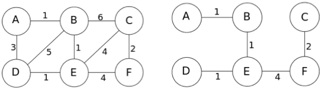

# <span style="color:#074b83">Exercices d'application - langage C++</span>

## <span style="color:#0a69b7">Arbre couvrant minimal (Minimum Spanning Tree - MST)</span>

La librairie standard templatisée C++ nous donne accès à un large nombre de conteneurs (containers) et de structures de données que nous pouvons dès à présent utiliser dans nos programmes. Nous allons apprendre comment utiliser une [file d'attente à priorité (priority queue)](http://www.cplusplus.com/reference/queue/priority_queue), qui est disponible dans le header [file d'attente (queue)](https://cplusplus.com/reference/queue/).

Un problème que nous pouvons résoudre en utilisant une file d'attente à priorité (priority queue) est celui du calcul d'un [arbre couvrant minimal (minimum spanning tree)](https://algs4.cs.princeton.edu/43mst/). A l'aide d'un graphe indirect complètement connecté dans lequel chaque connexion a un poids, nous aimerions trouvé l'ensemble des noeuds avec le plus petit total des poids. Cela pourrait paraître abstrait; ainsi nous proposons un scénario concret:

Vous êtes un ingénieur génie civil et vous êtes en train d'essayer de déterminer quel est le meilleur moyen de mettre en place un accès internet dans votre pétit pays île appelé C-Land. Il y a $N$ ($3 \leq N \leq 250,000$) villes sur votre ile qui sont connectées par $M$ ($N \leq M \leq 250,000$) routes variées et vous pouvez marcher entre chaque pair de villes sur l'île en traversant certaines séquences de routes.

Cependant, vous avez un budget limité et avez déterminé que le moyen le moins chère pour mettre en place une connexion internet est de construire des câbles de fibre optique le long des routes existantes. Vous avez une liste des coûts d'installation de câbles de fibre optique le long de n'importe quelle route spécifique, et voudriez comprendre de quelle somme d'argent vous aurez besoin pour finir avec succès le projet - ce qui veut dire, qu'à la fin, chaque ville sera connectée suivant une séquence de câbles de fibre optique.

Heureusement, vous êtes aussi un informaticien résident de C-Land, et vous vous rappelez avoir entendu parlé de [l'algorithme de Prim](https://en.wikipedia.org/wiki/Prim's_algorithm) dans l'un de vos anciens cours de programmation. Cet algorithme est exactement la solution à votre problème, mais il demande une file d'attente à priorité (priority queue)... et abracatabra! Ici la librairie standard templatisée de C++ vient à la rescousse.

Si ce scenario n'est pas encore totalement clair, regardez à la description de la donnée d'entrée ci-dessous. Notre donnée d'entrée décrivant le graphe sera présentée comme une liste de connexions (routes et leur coût de fibre optique) et pour notre programme, nous allons la convertir en une liste de contiguité (adjacency list): pour chaque noeud dans le graphe (ville dans le pays), nous aurons une liste des noeuds (villes) auxquels il est conneccté et le poids (coût de l'installation des câbles de fibre optique).

```txt
        adj[0] -> (1, 1.0) (3, 3.0)
        adj[1] -> (0, 1.0) (2, 6.0) (3, 5.0) (4, 1.0)
            .
            .
            .
```

Cette structure de données pourrait être difficile à allouer en mémoire et monitorer dans le langage C. La librairie standard templatisée (STL) de C++ simplifiera les choses. Premièrement, notre liste de contiguité (adjacency list) peut être représentée comme une liste de [vecteurs](https://cplusplus.com/reference/vector/vector/) C++, un pour chaque noeud. Pour simplifier encore plus et conceptualiser les choses, nous avons une classe wrapper appelée _AdjacencyList_ définie ci-dessous que vous pouvez utiliser; elle a déjà une méthode écrite pour aider à la lecture de l'entrée.

### <span style="color:#0c87eb">Limite de ressource</span>

Votre programme sera autorisé à s'executer en maximum $3$ secondes et à occuper au maximum $32MB$ de RAM.

### <span style="color:#0c87eb">Format d'entrée</span>

Ligne $1$: Deux entiers séparés par un espace: $N$, le nombre de noeuds dans le graphe, et $M$, le nombre de connexions.

Lignes $2, ..., M+1$: Ligne $i$ contient trois nombres séparés par des espaces décrivant une connexion: $s_{i}$ et $t_{i}$, les identifiants des deux noeuds concernés, et $w_{i}$, le poids de la connexion.

### <span style="color:#0c87eb">Exemple de format d'entrée (fichier mst.in)</span>

```txt
6 9
0 1 1.0
1 3 5.0
3 0 3.0
3 4 1.0
1 4 1.0
1 2 6.0
5 2 2.0
2 4 4.0
5 4 4.0
```

### <span style="color:#0c87eb">Explication de l'entrée</span>

Nous pouvons visualiser ce graphe comme dans la figure ci-dessous; soient $A$, $B$, $C$, ... les noeuds avec les identifiants $0$, $1$, $2$, $...$ respectivement. En regardant au fichier d'entrée, nous pouvons voir que la seconde ligne $0$ $1$ $1.0$ décrit la connexion entre $A$ et $B$ de poids $1.0$ dans notre diagramme, la troisième ligne $1$ $3$ $5.0$ décrit la connexion entre $B$ et $D$ de poids $5.0$, ainsi de suite. A droite, nous pouvons voir un arbre couvrant minimal (minimum spanning tree) pour notre graphe. 

{ align=center }

Chaque sommet fait partie d'un composant totalement connecté, et les connexions ici ont un poids total égal à $1.0+1.0+1.0+4.0+2.0 = 9.0$, qui fera partie de la sortie de notre programme.

### <span style="color:#0c87eb">Format de sortie</span>

Ligne $1$: Un seul nombre décimal affiché sur au moins une précision de $8$ nombres décimaux, représentant le poids total d'un arbre couvrant minimal (minimum spanning tree) pour le graphe donné.

### <span style="color:#0c87eb">Exemple de fichier de sortie (fichier mst.out)</span>

```txt
9.00000000
```

### <span style="color:#0c87eb">Code Template</span>

Vous pouvez vous baser sur le code suivant de structure de données pour la résolution de ce problème.

```cpp
#include <vector>

class State {
  size_t  node;
  double  dist;
public:
  State( size_t aNode, double aDist ) : _node{aNode}, _dist{aDist} {}
  inline size_t node() const { return _node; }
  inline double dist() const { return _dist; }
};

class AdjacencyList {
  std::vector< std::vector<State> > _vert;
  AdjacencyList() = delete;
public:
  AdjacencyList( std::istream &input );
  inline size_t size() const { return _vert.size(); }
  inline const std::vector<State>& vert( size_t node ) const {
    return _vert[node];
  }
  void print();
};
```

Certaines questions que vous pouvez vous poser pour la compréhension:

* Que signifie $AdjacencyList() = delete;$ ? Pourquoi avions-nous fait cela ?
* Cette ligne ci-dessous moyennement compliquée:

```cpp
inline const std::vector<State>& vert( size_t node ) const
```

Justifier et challenger chaque utilisation de const.

* Pourquoi n'avons nous pas besoin d'écrire notre propre destructeur de la classe _AdjacencyList_ ?
* Quel est l'espace le plus probable qu'occupe une seule instance de la classe _State_ en mémoire ?

Pensez à ces questions et posez tout point d'incertitude dans la discussion ci-dessous. Pour tester le code, l'on pourrait utiliser l'ensemble des fichiers se trouvant dans [mst.data.zip](https://ocw.mit.edu/courses/6-s096-effective-programming-in-c-and-c-january-iap-2014/resources/mst-data/).

## <span style="color:#0a69b7">Exemple de solution au Problème</span>

```cpp
/*
PROG: mst
LANG: C++
*/

#include <vector>
#include <queue>
#include <fstream>
#include <iostream>
#include <iomanip>
#include <unordered_map>


class State {
  size_t _node;
  double _dist;
public:
  State( size_t aNode, double aDist ) : _node{aNode}, _dist{aDist} {}
  inline size_t node() const { return _node; }
  inline double dist() const { return _dist; }
};

class AdjacencyList {
  std::vector< std::vector< State>  > _adj;
  AdjacencyList() = delete;
public:
  AdjacencyList( std::istream &input );
  inline size_t size() const { return _adj.size(); }
  inline const std::vector& adj(size_t node ) const { return _adj[node]; }
  void print();
};

inline bool operator<( const State &a, const State &b ) {
  return a.dist() > b.dist();
}

AdjacencyList::AdjacencyList( std::istream &input ) : _adj{} {
  size_t nNodes; 
  size_t nEdges; 
  input >> nNodes >> nEdges;
  _adj.resize( nNodes );
 
  for( size_t e = 0; e < nEdges; ++e ) {
    size_t v, w;
    double weight;
    input >> v >> w >> weight;
    
    // Ajoute cette connexion aux deux listes v et w
    _adj[v].push_back( State{ w, weight } );
    _adj[w].push_back( State{ v, weight } );
  }
}

void AdjacencyList::print() {
  for( size_t i = 0; i < _adj.size(); ++i ) {
    std::cout << i << ": ";
    for( auto state : _adj[i] ) {
      std::cout << "(" << state.node() << ", " << state.dist() << ") ";
    }
    std::cout << "\n";
  }
}
 
double prim( const AdjacencyList &adj ) {
  std::unordered_map<int, bool> visited;
  std::priority_queue<State> pq;
 
  pq.push( State{ 0, 0.0 } );
  double weight = 0.0;
 
  while( visited.size() < adj.size() ) {
    auto top = pq.top(); 
    pq.pop();
 
    if( visited.count( top.node() ) == 0 ) {
      visited[top.node()] = true;
      weight += top.dist();
 
      for( auto vertex : adj.adj( top.node() ) ) {
        pq.push( vertex );
      }
    }
  }
 
  return weight;
}
 
int main() {
  std::ifstream input{ "mst.in" };
  std::ofstream output{ "mst.out" };
 
  if( input.is_open() ) {
    auto adj = AdjacencyList{ input };
    output << std::fixed << std::setprecision( 8 );
    output << prim( adj ) << "\n";
  } else {
    std::cerr << "Could not open mst.in\n";
    return 1;
  }
   
  return 0;
}
```

## <span style="color:#074b83">Bibliographie</span>

* MIT OCW, Effective Programming in C and C++, [https://ocw.mit.edu/courses/6-s096-effective-programming-in-c-and-c-january-iap-2014/](https://ocw.mit.edu/courses/6-s096-effective-programming-in-c-and-c-january-iap-2014/), consulté le 15/11/2023.
* Algorithms, 4th edition, Minimum Spanning Trees, [https://algs4.cs.princeton.edu/43mst/](https://algs4.cs.princeton.edu/43mst/), consulté le 15/11/2023.
* CPlusPlus, Priority Queue, [http://www.cplusplus.com/reference/queue/priority_queue](http://www.cplusplus.com/reference/queue/priority_queue), consulté le 15/11/2023.
* CPlusPlus, Queue, [https://cplusplus.com/reference/queue/](https://cplusplus.com/reference/queue/), consulté le 15/11/2023. 
* Wikipedia, Prim's algorithm, [https://en.wikipedia.org/wiki/Prim's_algorithm](https://en.wikipedia.org/wiki/Prim's_algorithm), consulté le 15/11/2023.
* CPlusPlus, Vector, [https://cplusplus.com/reference/vector/vector/](https://cplusplus.com/reference/vector/vector/), consulté le 15/11/2023.
