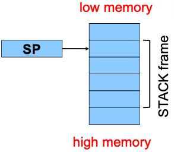

# <span style="color:#074b83">L'assembleur - Un langage plus proche de la machine</span>

## <span style="color:#0a69b7">Les niveaux de langage de programmation</span>

Dans cette section, nous faisons un tour rapide des niveaux de langages de programmation communement utilisés: le langage haut-niveau, le langage bas niveau et l'assembleur. Puis, nous mettons en exergue les avantages de l'apprentissage de l'assembleur.

### <span style="color:#0c87eb"> Comparison de niveaux de langage et l'assembleur </span>

!!! note "__Langage haut-niveau__:"
    
    Les langages C ou C++ sont des langages de haut niveau qui permettent:

    * d'avoir un code qui est portable (à des dégrés variés) sur plusieurs types de machines et d'environnements de programmation (Operating System)
    * synthétique (et parfois complexe) dans la mesure où il est possible en une instruction d'effectuer plusieurs opérations. Cela donne un bon ratio entre la fonctionnalité implémentée et la taille du code
    * Lisible par l'homme (ou "human readable" en anglais) avec des mots-clés qui facilitent la structure ou la lecture (par exemple if(), for() et while())

!!! example "__Exemple de code langage haut-niveau__:"

    Un exemple de code de langage haut-niveau, ici en C:

    ```c
    count = 0;
    while (n > 1)
    {
        count++;
        if (n & 1)
            n = n*3 + 1;
        else:
            n = n/2;
    }
    ```

!!! note "__Langage machine__:"

    Le langage machine a les caractéristiques suivantes:

    * Il n'est pas portable dans la mesure où il dépend fortement de la machine utilisée
    * Simplicité dans l'exécution dans la mesure où chaque instruction effectue une tâche simple, cela donne un ratio entre la fonctionnalité et temps pris pour l'effectuer
    * Pas de lisibilité par l'homme car le code n'est pas structuré, demande beaucoup d'efforts et d'outils de support

!!! example "__Exemple de code en langage machine__:"

    Un exemple de code de langage machine se trouve ci-dessous:

    ```txt
    0000 0000 0000 0000 0000 0000 0000 0000
    0000 0000 0000 0000 0000 0000 0000 0000
    9222 9120 1121 A120 1121 A121 7211 0000
    0000 0001 0002 0003 0004 0005 0006 0007
    0008 0009 000A 000B 000C 000D 000E 000F
    0000 0000 0000 FE10 FACE CAFE ACED CEDE
    1234 5678 9ABC DEF0 0000 0000 F00D 0000
    0000 0000 EEEE 1111 EEEE 1111 0000 0000
    B1B2 F1F5 0000 0000 0000 0000 0000 0000
    ```

!!! note "__Langage assembleur__:"

    Le langage assembleur a les caractéristiques suivantes:

    * Il n'est pas portable dans la mesure où chaque instruction en assembleur correspond à un code machine spécifique
    * Simplicité dans l'exécution dans la mesure où chaque instruction effectue une tâche simple
    * Lisibilité par l'homme (de la même manière que le chinois est lisible si on connaît le chinois)

!!! example "__Exemple de code en langage assembleur__:"

    Un exemple de code de langage assembleur se trouve ci-dessous:

    ```txt
        mov     w1, 0
    loop:
        cmp     w0, 1 
        ble     endloop
        add     w0, w0, #1 
        ands    wzr, w0, #1
        beq     else
        add     w2, w0, w0
        add     w0, w0, w2 
        add     w0, w0, 1 
        b       endif
    else:
        asr     w0, w0, 1
    endif:
        b       loop
    endloop:
    ```

### <span style="color:#0c87eb"> Pour quelles raisons devons-nous apprendre l'assembleur ? </span>

!!! warning "__Avantages d'apprendre l'assembleur__:"

    Les avantages d'apprendre l'assembleur sont:

    * Écrire plus rapidement du code

        * En langage assembleur
        * En langage de haut-niveau (C/C++, Python)

    * Écrire un code plus sûre

        * Comprendre les mécanismes de potentiels problèmes de sécurité vous aide à les éviter - même dans les langages de haut-niveau

    * Comprendre ce qui se passe "sous le capot"

        * Il y a besoin de développer le système informatique du futur
        * peut-être serait-il vous ?

    * Devenir plus à l'aise avec plusieurs niveaux d'abstractions

        * Devenir un meilleur programmeur

!!! warning "__Pour quelle raison apprendre l'assembleur ARM 64 bits ?__:"

    Apprendre plus spécifiquement l'assembleur ARM 64 Bits (à partir de l'__ARMv8__) est utile car :

    * ARM est le processeur le plus largement utilisé dans le monde (dans les téléphones, dans les objets connectés)
    * ARM a des instructions de programmation relativement élégantes comparées aux instructions des architectures de processeurs x86-64

    Cependant, au niveau des ordinateurs, la domination des processeurs ARM n'est pas effective puisque les processeurs x86-64 y sont encore très représentés. Pour comprendre la différence entre les architectures de processeurs de type ARM et les architectures de processeurs de type x86-64, consulté la discussion [How does the ARM architecture differ from x86?](https://stackoverflow.com/questions/14794460/how-does-the-arm-architecture-differ-from-x86#14795541).

## <span style="color:#0a69b7">Architecture</span>

Après une présentation brève des avantages d'apprendre l'assembleur, nous allons brièvement présenter des éléments d'architecture d'ordinateur.

### <span style="color:#0c87eb"> L'architecture Von Neumann </span>

Von Neumann est un scientifique éminent qui a eu des contributions dans divers domaines (physique, théorie des jeux, informatique). Il est connu pour l'architecture "Von Neumann" en informatique.

!!! note "__Présentation haut-niveau__:"

    

    * Les instructions sont issues de la mémoire vive, RAM (Random Access Memory). Ces dernières sont écrites avec des mots.
    * L'unité de contrôle (Control unit) interprète les instructions:

        * pour faire circuler la donnée ou l'information entre les registres (registers) et la mémoire vive (RAM)
        * pour déplacer la donnée des registres à l'unité arithmétique + logique (ALU - arithmetic+logic unit) où les opérations sont effectuées

!!! note "__Mémoire vive - RAM (Random Access Memory)__:"

    Il s'agit de large blocs de mémoire de bytes ou de gigabytes dans les machines modernes. Pour plus de détails sur la mémoire vive (RAM), se reférer à l'article [Random-access memory](https://en.wikipedia.org/wiki/Random-access_memory). La mémoire vive:

    * Contient de la donnée (variables de programmes, structures (structs), tableau (arrays))
    * Contient le programme!

    Les instructions sont prélévées de la mémoire vive (RAM).

!!! note "__Registres (registers)__:"

    Il s'agit de petits espaces de stockage sur le CPU (des dizaines de mots dans des machines modernes)

    * Plus rapides que la mémoire vive (RAM)
    * Plus haut niveau de la "hierarchie de stockage": au dessus de la mémoire vive (RAM), du disque, etc.

    Les instructions de l'unité arithmétique et logique (ALU - arithmetic+logic unit) opèrent sur les registres.

### <span style="color:#0c87eb"> Interaction registres et RAM </span>

!!! note "__Comportement type__:"

    * Chargement de la donnée de la mémoire vive (RAM) jusqu'aux registres
    * Manipule (Operations sur) la donnée dans les registres
    * Sauvegarde la donnée des registres dans la RAM

!!! note "__Sur les architectures 64 bits, AARCH64, certaines restrictions demeurent__:"

    * Les instructions de "Manipulation" ou opérations peuvent seulement avoir accès aux registres
    * Cela est connu comme une architecture de type __chargement/sauvegarde__
    * Caractéristique du "RISC" (Reduced Instruction Set Computer, c'est-à-dire ensemble d'instructions réduites) sur les architectures de processeurs ARM (> v8) vs. "CISC" (Complex Instruction Set Computer, c'est-à-dire, ensemble d'instructions complexes) sur les architectures de processeurs x86-64.

### <span style="color:#0c87eb"> Registres/registres architecture ARM-64 </span>

!!! note "Présentation registre architecture arm-64"

    

### <span style="color:#0c87eb"> Registres à objectifs généraux </span>

!!! note "__Définition__:"

    $$X0 .. X30$$

    * registres de $64-bits$
    * parcours l'espace pour les instructions, les paramètres d'entrée ou de sortie de fonctions, retourne l'adresse pour les appels de fonctions, etc.
    * Certains ont des objectifs spécifiques définis dans l'ordinateur (hardware) (par exemple $X30$) ou définies par des conventions logicielles (par exemple $X29$)
    * Aussi disponibles en versions de $32$-bits: $W0 .. W30$

    $$XZR$$

    * À la lecture: tous zéros
    * À l'écriture: la donnée est jetée

### <span style="color:#0c87eb"> Registres à objectifs spécifiques </span>

!!! note "__Registre SP__:"

    Le registre à objectif spécifique SP (Stack Pointer), contient un pointeur sur stack (SP - Stack Pointer): addresse du haut (addresse du bas) de la pile des fonctions. Il permet d'utiliser la pile de la mémoire.

    

!!! note "__Registre PC__:"

    Le registre à objectif spécifique PC (Program Counter):

    * Contient un PC (Program Counter)
    * Enregistre la localisation de l'instruction suivante: l'addresse (dans la section texte) des instructions en langage machine à être executer ensuite.
    * Valeur modifiée:

        * Automatiquement pour implémenter un flux de contrôle séquentiel
        * Par des instructions pour inplémenter la sélection, la repetition

    

!!! note "__Registre PSTATE__:"

    Ce registre est à objectif spécifique et:

    * Contient des __flags de condition__: __n(Negative), z(Zero), c(Carry), v(oVerflow)__
    * Est affecté par l'instruction de comparaison (_cmp_) ainsi que d'autres, si nécessaire
    * Est utilisé par des instructions conditionelles en branche: _beq, bne, blo, bhi, ble, bge, ..._

    

## <span style="color:#074b83">Langage assembleur - operations arithmétiques</span>

### <span style="color:#0c87eb"> ALU (Unité arithmétique et logique) </span>

!!! note "ALU"

    

### <span style="color:#0c87eb"> Format des instructions </span>

!!! note "format des instructions"

    Beaucoup d'instructions ont ce format:

    

    * name: nom de l'instruction (add, sub, mul, and, etc.)
    * s: si présent, spécifie que les flags de condition devraient être avoir une valeur

    * dest et src1, src2 sont $x$ registres: operation de $64$-bits
    * dest et src1, src2 sont $w$ registres: opération de $32$-bits

    * src2 pourrait être une constante ("valeur" immédiate) au lieu d'un registre

### <span style="color:#0c87eb"> Arithmétique </span>

!!! example "__Exemple 1:__ Opération arithmétique de $64$-bits"

    Code écrit en C:

    ```c
    static long length;
    static long width;
    static long perim;
    ...
    perim = (length + width)*2;
    ```

    En supposant que:

    * length est enregistré dans $x1$
    * width est enregistré dans $x2$
    * perim est enregistré dans $x3$

    Code écrit en assembleur, (se rappeler que l'utilisation du shift à gauche de $1$ est équivalent à multiplier par $2$):

    ```txt
    add x3, x1, x2
    lsl x3, x3, 1
    ```

!!! example "__Exemple 2:__ Plus d'arithmétique"

    ```c
    static long x;
    static long y;
    static long z;
    ...
    z = x - y;
    z = x * y;
    z = x / y;
    z = x & y;
    z = x | y;
    z = x ^ y;
    z = x >> y;
    ```

    En supposant que:

    * $x$ est enregistré dans $x_{1}$
    * $y$ est enregistré dans $x_{2}$
    * $z$ est enregistré dans $x_{3}$

    ```txt
    sub     x3, x1, x2
    mul     x3, x1, x2
    sdiv    x3, x1, x2
    and     x3, x1, x2
    orr     x3, x1, x2
    eor     x3, x1, x2
    lsr     x3, x1, x2
    ```

!!! example "__Exemple 3:__ Raccourcis"

    ```c
    static long x;
    static long z;
    ...
    z = x;
    z = -x;
    ```

    En supposant que:

    * $x$ est enregistré dans $x_{1}$
    * $z$ est enregistré dans $x_{3}$

    Les instructions assembleurs $xzr$:

    ```txt
    orr     x3, xzr, x1
    sub     x3, xzr, x1
    ```

    Ces instructions ci-dessus sont équivalentes à celles (raccourcis) ci-dessous:

    ```txt
    mov     x3, x1
    neg     x3, x1
    ```

!!! example "__Exemple 4:__ Signed vs Unsigned ?"

    ```c
    static long x;
    static unsigned long y;
    ...
    x++;
    y--;
    ```

    En supposant que:

    * $x$ est enregistré dans $x_{1}$
    * $y$ est enregistré dans $x_{2}$

    Les instructions assembleurs $xzr$:

    ```txt
    add     x1, x2, 1
    sub     x2, x2, 1
    ```

    La plupart du temps l'algorithme est le même pour les "signed" et les "unsigned" à certaines conditions:
    * on met différentes conditions dans le registre PSTATE
    * l'exception de la division où on utilise _udiv_ pour les "unsigned" au lieu de _sdiv_ pour les "signed"

!!! example "__Exemple 5:__ L'arithmétique de 32-bits"

    ```c
    static int length;
    static int width;
    static int perim;
    ...
    perim = (length + width) * 2;
    ```

    En supposant que:

    * $length$ est enregistré dans $w_{1}$
    * $width$ est enregistré dans $w_{2}$
    * $perim$ est enregistré dans $w_{3}$

    Code assembleur en utilisant le régistre "w":

    ```txt
    add w3, w1, w2
    lsl w3, w3, 1 
    ```

!!! example "__Exemple 6:__ L'arithmétique de 8-bits et 16-bits"

    ```c
    static char x;
    static short y;
    ...
    x++;
    y--;
    ```

    Il n'y a pas d'instructions spécialisées:

    * Utilisation de registres "w"
    * Lecture et stockage spécifiques d'instructions pour le transfert de petits types de données de, ou à partir de la mémoire
    * Correspond à la sémantique du langage C: toutes les opérations arithmétiques sont faites implicitement (au moins) sur les entiers (ints)

## <span style="color:#074b83">Bibliographie</span>

* Princeton University, [Assembly Language: Part 1](https://www.cs.princeton.edu/courses/archive/spr19/cos217/lectures/13_Assembly1.pdf), Archive Computer Science 217: Introduction to Programming Systems, consulté le 25/06/2024.
* Stack Overflow, [How does the ARM architecture differ from x86?](https://stackoverflow.com/questions/14794460/how-does-the-arm-architecture-differ-from-x86#14795541), consulté le 29/02/2024.
* Wikipedia, [Random-access memory](https://en.wikipedia.org/wiki/Random-access_memory), consulté le 01/03/2024.
