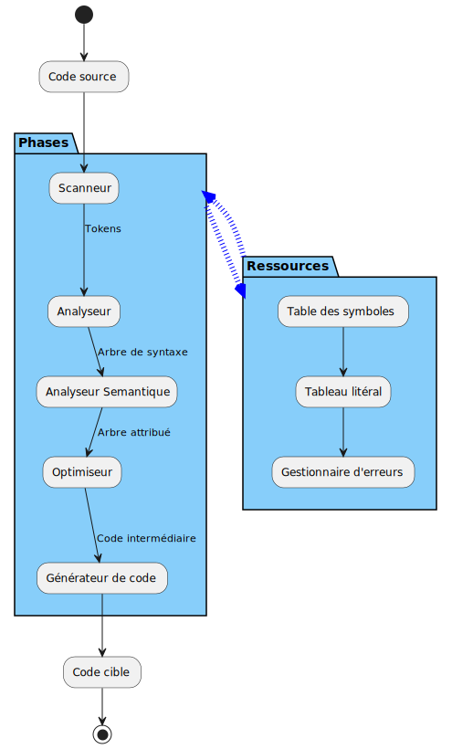

# Le compilateur

## I - Qu'est ce qu'un compilateur ?

Un compilateur est un programme informatique qui transforme le code écrit par l'homme en une suite d'instructions compréhensibles par l'ordinateur. En effet, un ordinateur ordinaire est composé de circuits électroniques qui ne comprennent que l'état 0 et 1 c'est-à-dire que le courant passe ou le courant ne passe pas. Par ordinateur ordinaire, on se refère aux ordinateurs de bureau ou personnels communement rencontrés.

## II - Comment fonctionne le compilateur ?

Le compilateur produit un code équivalent au code source dans un langage cible, très souvent en code objet, assembleur ou C. La plupart des compilateurs effectuent leurs tâches de manière séquentielle en passant par les phases qu’on peut voir ci-dessous.

## III - Zoom sur les phases

### 1. Le scanneur ou analyseur lexical

La première phase, appelée scanneur ou analyseur lexical, est la seule phase directement impliquée dans la lecture du programme source. Elle convertit les caractères du programme source en jetons, des séquences de caractères qui représentent les unités de base de la structure du programme. Les tokens typiques sont des mots-clés tels que *while*, des constantes numériques tels que *3.14159* et des identificateurs. 

### 2. L'analyseur syntaxique

La deuxième phase d'un compilateur est l'analyseur syntaxique, qui rassemble les séquences de jetons en unités complètes, telles que les expressions, les énoncés et les déclarations. Le résultat de l'analyseur syntaxique (explicitement ou implicitement) est un arbre ou une autre structure de données équivalente représentant la structure de l'unité de programmation qui vient d'être reconnue. Cet arbre est appelé arbre syntaxique abstraite (ASA) ou abstract syntaxic tree (AST) en anglais. 

### 3. L'analyseur sémantique

La troisième phase d'un compilateur est l'analyseur sémantique, qui calcule les attributs ou les propriétés de chaque bloc de programmation, ainsi que leur effet sur les attributs d'autres blocs. Les attributs typiques sont les types de données des expressions et les identificateurs, les tailles de mémoire et les emplacements de mémoire réels ou potentiels. L'analyseur sémantique détermine également si le programme a un sens en fonction de ces attributs. En d'autres termes, il effectue des contrôles de cohérence, tels que la vérification du type ou de la plage de valeurs. Le résultat de l'analyseur sémantique peut être représenté par un arbre attribué représentant l'arbre original modifié par les attributs calculés.

### 4. L'optimiseur

La quatrième phase d'un compilateur est appelée optimiseur dans la figure ci-dessus. Cette phase génère généralement une forme de code linéaire, appelé code intermédiaire, à partir de la représentation qui lui est transmise par l'analyseur sémantique. Elle applique également certaines formes d'algorithmes d'amélioration du code, soit avant, soit après la génération du code intermédiaire (ou les deux). Cette phase de la compilation est la plus variable d'un compilateur à l'autre; elle peut même être totalement absente. 

### 5. Le générateur de code

La cinquième et dernière phase du compilateur illustrée à la figure réprésentant les phases de la compilation est le générateur de code. Cette phase génère le code cible final et peut également apporter des améliorations supplémentaires au code. 

### 6. Interaction avec des ressources

Toutes les phases d'un compilateur interagissent avec diverses tables et gestionnaires au sein du compilateur. La figure montre trois exemples importants de ces autres composants : la table des symboles, la table littérale et le gestionnaire d'erreurs. Leur interaction avec les phases est mise en exergue par deux grandes flèches de sens opposés. 

#### a. La table des symboles

La table des symboles conserve les noms définis par le programme en cours de traduction, ainsi que les éventuels noms prédéfinis dans le langage, et associe les noms à leurs attributs, qui peuvent inclure la portée, l'emplacement en mémoire, le type de données et la taille de la mémoire.

La table des symboles peut être monolithique ou séparée en un arbre ou un graphe de tables plus petites, représentant différentes portées dans le programme. 

#### b. La table des symboles

Une table similaire est nécessaire pour les valeurs littérales qui apparaissent dans le programme, telles que les chaînes de caractères et les valeurs numériques littérales. 

#### c. Le gestionnaire d'erreurs

Le troisième composant illustré à la figure des phases d'un compilateur est le gestionnaire d'erreurs, dont le rôle est de générer différents types de messages d'erreur mais, plus important encore, d'assurer la récupération des erreurs, de sorte que la traduction puisse se poursuivre (du moins dans la mesure du possible) en présence d'erreurs. 

## IV - Quelques remarques

### 1. Les phases du compilateur ne sont pas représentatives du déroulement de la compilation

Il convient de souligner que les phases du compilateur ne sont que des unités logiques et qu'elles ne correspondent pas nécessairement à un groupement réel d'opérations au sein du compilateur lui-même, ni à une séquence temporelle de ces opérations.

En effet, il est courant que l'analyse, l'analyse syntaxique et certaines analyses sémantiques soient complètement intégrées en un seul passage sur le code source. Un compilateur peut même être à passage unique, en ce sens que toutes les phases, y compris la génération de code, sont exécutées simultanément (à condition que le langage lui-même le permette). Il est plus probable qu'il y ait des passages distincts pour l'analyse (y compris le balayage), l'optimisation et la génération de code (les passages ultérieurs utilisant le code intermédiaire généré par le premier passage). Si le langage n'exige pas que les noms soient déclarés avant d'être utilisés, une passe est également nécessaire pour résoudre les références aux noms. 

### 2. Une vue "back-end" et "front-end" des tâches dans le compilateur

Il est utile de diviser les tâches effectuées par un compilateur en une partie d'analyse et une partie de synthèse, parfois également appelées "front-end" et "back-end".

La partie analyse concerne l'analyse du programme source, tandis que la partie synthèse concerne la génération du programme cible. La partie analyse dépend principalement du langage source, tandis que la partie synthèse dépend principalement du langage cible ou de la machine cible. Le balayage, l'analyse syntaxique et l'analyse sémantique font partie de la partie frontale, tandis que la génération de code fait partie de la partie dorsale. L'optimisation et la génération de code intermédiaire nécessitent généralement des informations sur la source et la cible; il est plus difficile de les diviser en un composant frontal et un composant final. Plus cette opération est réussie, plus il est facile de recibler le compilateur. Dans le meilleur des cas, un groupe de compilateurs peut partager les composants frontaux et dorsaux de manière interchangeable. Une conception populaire et efficace d'un interpréteur consiste en un compilateur frontal et un interpréteur dorsal pour le code intermédiaire produit par le compilateur frontal. Il en résulte un interprète raisonnablement efficace qui est également facilement reciblable. Nous parlerons plus tard de la notion d'interpreteur.

## V - Langages compilés

### 1. Avantages

Le principal avantage du langage compilé est sa rapidité à l'execution grâce à une conversion préalable à l'exécution (compilation) du code source en un code cible de bas niveau compréhensible par l'ordinateur. Cependant, cet écart tend à se réduire avec certains langages utilisant la compilation durant l'exécution. Cette dernière affirmation demanderait un benchmark pour plus de sureté.

### 2. Quelques langages compilés

Quelques langages compilés communement utilsés sont Visual Basic, C, C++, Go, Java, Fortran, Pascal, Rust.

# References

* Tucker, Allen B., 2004. Computer science handbook, 2nd ed. Chapman & Hall/CRC.