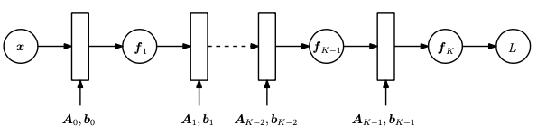
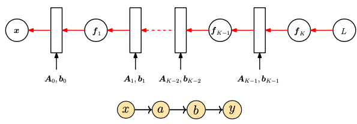
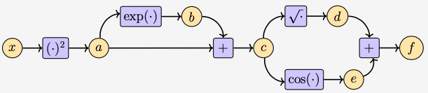

# Calcul différentiel ou calcul de dérivées, gradients (pour le ML)

Le calcul de dérivées de fonctions entre espaces affines est une notion fondamentale en machine learning.
En effet, c'est la base pour l'utilisation des fameux algorithmes d'optimisation utilisés en machine learning.

En adoptant une approche pour favoriser la compréhension, nous allons parfois faire l'impasse sur la rigueur au détriment de la simplicité. De ce fait, il est recommandé au lecteur souhaitant approfondir les notions présentées ici, de se reférer à la bibliographie ci-dessous.

## Topologie, espaces affines normés et dérivées

Avant d'effectuer la dérivée d'une fonction, il est important que l'espace sur lequel cette fonction existe soit clarifié.
En effet, la dérivée de fonction ne sied pas à certains espaces. Nous nous limiterons à une catégorie d'espaces affines (les espaces affines normés).

### Espaces affines normés

Nous avons déjà défini ce que représente un espace affine dans la page sur [l'algèbre linéaire](../algebra-analysis/al.md).

__Simplification de la notion d'espace affine__:

Pour rappel et plus simplement, un espace affine _L_ est un sous-espace d'un espace vectoriel _V_ (espace formé de vecteurs de sorte que toute combinaison linéaire de ceux-ci y réside) dont les éléments sont la somme d'un élément fixe $x_{0}$ de l'espace vectoriel de départ _V_ avec un élément quelconque $\vec{u}$ d'un sous-espace vectoriel _U_ de l'espace vectoriel de départ _V_.

Il est possible de mieux comprendre avec une représentation géométrique en deux dimensions; un espace affine représente une droite affine qui a un point d'intersection avec l'axe des ordonnées (c'est le point fixe) et un vecteur directeur (qui est le vecteur de la base d'un sous-espace vectoriel du plan de dimension 1). Les éléments d'un espace affine sont appelés des points tandis que ceux d'un espace vectoriel sont des vecteurs.

__Espace vectoriel normé__:

Un espace vectoriel normé est un espace vectoriel muni d'une norme. Généralement, l'ensemble auquel appartient la constante multiplicative est $\mathbb{R}$ (l'ensemble des nombres réels) ou $\mathbb{C}$ (l'ensemble des nombres complexes).

__Norme (de manière générale)__:

Une norme $\| \|$ sur un espace vectoriel $V$ est définie comme étant une fonction de $V$ vers $\mathbb{R}^{+}$ (l'ensemble des nombres réels positifs) qui satisfait les règles de positivité, de scaling et d'inégalité triangulaire. En d'autres termes, $\| \|: V \rightarrow \mathbb{R}^{+}$ est telle que $\forall x, y, z \in V$ (pour tout $x$, $y$ et $z$ éléments de l'espace vectoriel $V$):

* (Positivité) $\|x\| \geq 0$ et $\|x\| = 0$ si et seulement si $x = 0$.
* (Scaling) $\|\lambda x\| = |\lambda| \|x\|$
* (Inégalité triangulaire) $\|x + y\| \leq \|x\| + \|y\|$

__Espace affine normé__:

Soit $L$ un espace affine d'un sous espace vectoriel $V$ reposant sur le sous-espace vectoriel $U$ (c'est-à-dire tout élément de $L$ peut s'écrire comme la somme d'un élément fixe $x_{0}$ de $V$ et d'un élément quelconque $u$ de $U$). $L$ est un espace affine normé si l'espace vectoriel sur lequel il repose est normé.

__Support affine (affine frame)__:

Soit $E$ un espace affine de dimension finie $n$ et d'espace vectoriel associé $\vec{E}$. Si $(u_{1}, ..., u_{n})$ est une base de $\vec{E}$, on dit que $(a_{0}, (u_{1}, ..., u_{n}))$ est un support affine (affine frame) de $E$ s'il est possible d'écrire tout élément de $E$ comme étant la somme d'un élément de $\vec{E}$ (qui est combinaison linéaire des vecteurs de base) et du vecteur $a_{0}$.

### Quelques notions de topologie

__Espace métrique__:

Un espace métrique est un ensemble $E$ avec une fonction $d: E \times E \rightarrow \mathbb{R}_{+}$, appelée métrique, ou distance, assignant un nombre réel positif $d(x,y)$ à tous éléments $x, y \in E$, vérifiant les conditions suivantes pour tout $x, y, z \in E$:

* (Symmétrie) $d(x, y) = d(y, x)$
* (Positivité) $d(x,y) \geq 0$ et $d(x, y) = 0$ si et seulement si $x = y$.
* (Inégalité triangulaire) $d(x, z) \leq d(x, y) + d(y, z)$

__Balle ouverte__:

Pour un espace métrique $E$ avec une métrique $d$, pour chaque élément $a \in E$, pour chaque $\rho \in \mathbb{R}$, avec $\rho > 0$, l'ensemble

$$ B(a, \rho) = \{x \in E | d(a, x) < \rho \} $$

est appelé la balle ouverte (open ball) de centre $a$ et de rayon $\rho$.

__Ensemble ouvert, ensemble fermé__:

Soit $(E, d)$ un espace métrique. Un sous-ensemble $U \subseteq E$ est un ensemble ouvert dans $E$ si soit $U = \emptyset$ ou pour chaque $a \in U$, il y a une balle ouverte $B(a, \rho)$ tel que, $B(a, \rho) \subseteq U$. Un sous-ensemble $F \subseteq E$ est fermé dans $E$ si son complémentaire c'est-à-dire $E - F$ est ouvert dans E.

__Espace topologique__:

Soit un ensemble $E$, une topologie sur $E$ (ou structure topologique sur $E$), est définie comme une famille $\mathcal{O}$ de sous-ensembles de $E$ appelés _ensembles ouverts_ (_open sets_), et vérifiant les trois propriétés suivantes:

* Pour chaque famille finie $(U_{i})_{1 \leq i \leq n}$ d'ensembles $U_{i} \in \mathcal{O}$, nous avons $U_{1} \cap ... \cap U_{1} \in \mathcal{O}$, c'est-à-dire, $\mathcal{O}$ est fermé sous les intersections finies.
* Pour chaque famille finie $(U_{i})_{i \in I}$ d'ensembles $U_{i} \in \mathcal{O}$, nous avons $\cup_{i \in I} U_{i} \in \mathcal{O}$, c'est-à-dire $\mathcal{O}$ est fermé sous union arbitraire.
* $\emptyset \in \mathcal{O}$, et $E \in \mathcal{O}$, c'est-à-dire, $\emptyset$ et $E$ appartiennent à $\mathcal{O}$.

$(E, \mathcal{O})$ est appelé est un espace topologique.

__Voisinage__:

Pour tout espace topologique $(E, \mathcal{O})$, le voisinage d'un point $a \in E$ est défini comme étant tout sous-ensemble $N$ de $E$ contenant un ensemble ouvert $O \in \mathcal{O}$ tel que $a \in O$.

### Dérivée de fonction

Pour une fonction $f$ definie sur un sous-ensemble $A$ d'un espace affine normé $E$ vers un autre espace affine normé $F$, il existe deux notions de dérivées de cette fonction en un point $a \in A$ ($a$ appartenant à $A$): dérivée au sens de Gateaux et dérivée au sens de Fréchet. Avant de définir ces notions, il est important de définir la notion de limite et celle de continuité de fonction.

__Séquence__:

Pour tout ensemble $E$, une séquence est une fontion $x$ définie de l'espace des entiers naturels ($\mathbb{N}$) vers l'ensemble $E$. On note la séquence $(x_{n})_{n \in \mathbb{N}}$, ou $(x_{n})_{n \geq 0}$.

__Limite__:

Pour un espace topologique $(E, \mathcal{O})$, on dit qu'une séquence $(x_{n})_{n \in \mathbb{N}}$ converge vers un point $a \in E$ si pour tout ensemble ouvert $U$ contenant $a$, il existe un entier naturel $n_{0}$ à partir duquel tous les éléments de la séquence d'indice supérieur appartienne à $U$. En d'autres termes $x_{n} \in U, \forall n \geq n_{0}$.

Géométriquement, l'on peut interpreter que pour tout segment (ou disque ou sphere) autour du point $a$, il existe toujours un indice à partir duquel les éléments de la suite dont l'indice est plus grand appartiennent à ce segment (ou ce disque ou cette sphère).

On écrit:

$$ lim_{n \rightarrow \infty} x_{n} = a $$

__Fonction continue__:

Pour deux espaces topologiques $(E, \mathcal{O}_{E})$ et $(F, \mathcal{O}_{F})$ et une fonction $f: E \rightarrow F$. On dit que la fonction $f$ est continue en $a$, si pour chaque ensemble ouvert $V \in \mathcal{O}_{F}$ contenant $f(a)$, il existe un ensemble ouvert $U \in \mathcal{O}_{E}$ contenant $a$, tel que, $f(U) \subseteq V$ ($f(U)$ est inclus dans ou égal à $V$). On dit que $f$ est continue si elle est continue en tout point $a \in E$.

__Dérivée au sens de Gâteaux (ou dérivée directionnelle)__:

Pour tout point $a$ de $A$ ($a \in A$) et tout vecteur $\vec{u}$ de l'espace vectoriel $\vec{E}$ sur lequel repose $E$, la dérivée de $f$ en $a$ par rapport au vecteur $\vec{u}$ est (si la limite existe):

$$ lim_{t \rightarrow 0, t \in U} \frac{f(a+t\vec{u}) - f(a)}{t} $$

où $U = \{ t \in \mathbb{R} | a + t\vec{u} \in A, t \neq 0\} (ou U = \{t \in \mathbb{C} | a + t\vec{u} \in A, t \neq 0\})$. On l'appelle la _dérivée directionnelle ou de Gâteaux_ et on la note alors $D_{\vec{u}}f(a)$.

__Dérivée au sens de Fréchet__:

Pour tout point $a$ de $A$ ($a \in A$), on dit que $f$ est différentiable en $a \in A$, s'il existe une fonction linéaire continue $L: \vec{E} \rightarrow \vec{F}$ (appelée la _dérivée au sens de Fréchet ou dérivée totale_ et notée _Df(a) ou df(a)_) et une fonction $\epsilon$, telle que:

$$ f(a + h) = f(a) + L(h) + \epsilon(h)\|h\| $$

pour tout $a + h \in A$, où $\epsilon(h)$ est définie pour tout $h$ tel que $a + h \in A$ et

$$ lim_{h \rightarrow 0, h \in U} \epsilon(h) = 0, $$

Où $U = \{\vec{h} \in \vec{E} | a + \vec{h} \in A, h \neq 0\}$.

### Dérivée partielle de fonction

Soit $E$ et $F$ deux espaces affines normés tels que l'espace affine $E$ soit de dimension finie $n$.
Notons par $(u_{1}, u_{2}, ..., u_{n})$ une base de l'espace vectoriel $\vec{E}$ (qui représente l'espace vectoriel associé à l'espace affine $E$) et $a_{0}$ le point de $E$ tel que tout élément de $E$ s'écrit comme la somme de $a_{0}$ et d'un élément de $\vec{E}$ (d'après la définition de $E$ et de $\vec{E}$). On peut appeler $(a_{0}, (u_{1}, u_{2}, ..., u_{n}))$, le support (frame en anglais) de $E$.

Ainsi, nous pouvons dire que tout élément $x$ de $E$ s'écrit sous la forme:

$$ x = a_{0} + \sum_{i=1}^{n} \lambda_{i}u_{i} $$

Pour tout élément $a \in E$ (a appartenant à $E$) et toute fonction $f: E \rightarrow F$, les dérivées directionnelles $D_{u_{j}}f(a)$ (si elles existent) sont appelées les dérivées partielles de $f$ par rapport au support $(a_{0}, (u_{1}, u_{2}, ..., u_{n}))$. La dérivée partielle $D_{u_{j}}f(a)$ est aussi notée $\partial_{j}f(a)$ , ou $\frac{\partial f}{\partial x_{j}}(a)$. Ainsi:

$$ \frac{\partial f}{\partial x_{j}}(a) = lim_{t \rightarrow 0} \frac{f(a+tu_{j}) - f(a)}{t} $$

Pour plus de simplicité dans la compréhension, dans la suite de cette page, nous considérons l'espace affine normé $E$ de dimension finie comme étant l'espace $\mathbb{R}^{n}$ qui est à la fois un espace vectoriel et affine normé. Cela peut se faire sans aucun problème au niveau de la rigueur d'après un résultat énoncé sur la page relative à [l'algèbre linéaire](al.md) qui stipule qu'on peut démontrer qu'il existe une fonction bijective entre $E$ et $\mathbb{R}^{n}$. La preuve de ce résultat est simple, en définissant pour une base $(e_{1}, ..., e_{n})$ de $E$, l'image de $e_{i}$ (pour $i \in \{1, ..., n\}$) comme étant le vecteur de $\mathbb{R}^{n}$ contenant $1$ à la $i$-ème position et $0$ ailleurs.

### Gradient

Le gradient d'une fonction $f$ définie sur $\mathbb{R}^{n}$ et dont l'ensemble image est $\mathbb{R}$ (plus formellement $f:\mathbb{R}^{n} \rightarrow \mathbb{R}$) est la collection des dérivées partielles de la fonction $f$ c'est-à-dire:

$$\nabla_{x}f = gradf = \frac{df}{dx} = \left[\frac{\partial f(x)}{\partial x_{1}} \frac{\partial f(x)}{\partial x_{2}} ... \frac{\partial f(x)}{\partial x_{n}}\right] \in \mathbb{R}^{1 \times n}$$

Le gradient de fonctions est beaucoup utilisé, pour par exemple, déterminer le sens de variation d'une fonction et plus généralement dans beaucoup d'algorithmes de calcul numérique où l'on a besoin d'optimiser une fonction cible.

## Quelques propriétés de dérivées

Après avoir défini les notions de dérivées, de dérivées partielles et de gradients, nous allons citer quelques propriétes du calcul de dérivées de fonctions.

### Gradient par rapport à un vecteur - matrice Jacobienne

Lorsque l'espace affine $E$ est de dimension finie $n$, nous avons vu que nous pouvons considérer les résultats sur $\mathbb{R}^{n}$. De même, lorsque $F$ est de dimension finie $m$, nous pouvons aussi en lieu et place considérer l'espace $\mathbb{R}^{m}$. Ainsi, pour toute fonction $f: \mathbb{R}^{n} \rightarrow \mathbb{R}^{m}$, lorsque $m > 1$ ($m$ est supérieur strictement à $1$) et pour $a \in E = \mathbb{R}^{n}$, nous définissons la matrice Jacobienne notée $J(f)(a)$ de $Df$ en $a$ (de la dérivée de $f$ en $a$) comme étant la matrice composée des dérivées partielles de $f$ (si elles existent):

$$ J(f)(a) = \left(\begin{array}{cccc}
\frac{\partial f_{1}}{\partial x_{1}}(a) & \frac{\partial f_{1}}{\partial x_{2}}(a) & ... & \frac{\partial f_{1}}{\partial x_{n}}(a)\\
\frac{\partial f_{2}}{\partial x_{1}}(a) & \frac{\partial f_{2}}{\partial x_{2}}(a) & ... & \frac{\partial f_{2}}{\partial x_{n}}(a)\\
. & . &  & .\\
. & . &  & .\\
. & . &  & .\\
\frac{\partial f_{m}}{\partial x_{1}}(a) & \frac{\partial f_{m}}{\partial x_{2}}(a) & ... & \frac{\partial f_{m}}{\partial x_{n}}(a)\\\end{array}\right)$$

__Remarque:__
Lorsque $m = n$, alors le déterminant de la matrice Jacobienne $J(f)(a)$ de $Df$ en $a$, est appelé la jacobienne de $Df(a)$.

### Quelques propriétés pour le calcul de gradient

Ici la notation est simplifiée; il convient donc de faire attention à la variable par rapport à laquelle la dérivée est calculée.
Soit $f$ et $g$ deux fonctions telles que l'ensemble des opérations suivantes de produit, de somme et de composition sont possibles. C'est-à-dire:

* Pour la somme, cela veut dire que les espaces affines de départ et images sont les mêmes pour $f$ et $g$
* Pour le produit de $f$ par $g$, il est possible de multiplier la fonction $f$ par la fonction $g$
* Pour la composition, l'image de $f$ est dans l'espace de départ de $g$

__Product rule (règle de produit)__:

$$\frac{\partial}{\partial \textbf{x}} \left(f(\textbf{x})g(\textbf{x})\right) = \frac{\partial f}{\partial \textbf{x}}g(\textbf{x}) + f(\textbf{x})\frac{\partial g}{\partial \textbf{x}}$$

__Sum rule (règle de somme)__:

$$\frac{\partial}{\partial x} \left(f(\textbf{x}) + g(\textbf{x})\right) = \frac{\partial f}{\partial \textbf{x}}(\textbf{x}) + \frac{\partial g}{\partial \textbf{x}}(\textbf{x})$$

__Chain rule (règle de composition)__:

$$\frac{\partial}{\partial x} \left(g \circ f\right)(\textbf{x}) = \frac{\partial}{\partial x} \left(g\left(f(\textbf{x})\right)\right) = \frac{\partial g}{\partial f}\frac{\partial f}{\partial \textbf{x}}$$

Lorsqu'on calcule la dérivée par rapport à un vecteur $x \in \mathbb{R}^{n}$ (lorsque $n=1$, il s'agira de dérivée partielle ou de dérivée simple et lorsque $n>1$, il s'agira de gradient), il est important de noter que le gradient prend en compte des vecteurs et des matrices. Et de plus, la multiplication de matrices n'est pas commutative.

### Gradient par rapport à une matrice

Le gradient de matrices par rapport à des vecteurs (ou d'autres matrices) donne un tenseur. Par exemple, si nous calculons le gradient d'une matrice $A$, $m \times n$ par rapport à une matrice $p \times q$ $B$, le résultat serait un tenseur $J$ de dimension $4$, $(m \times n) \times (p \times q)$ dont les éléments sont donnés par $J_{ijkl} = \partial A_{ij}/\partial B_{kl}$.

__Exemple 1:__

Pour,

$$ f = Ax, f \in \mathbb{R}^{M}, A \in \mathbb{R}^{M \times N}, x \in \mathbb{R}^{N}$$

On a:

$$ \frac{df}{dA} \in \mathbb{R}^{M \times (M \times N)}$$

La dérivée partielle de $f_{i}$ par rapport à une ligne de $A$, est donnée par:

$$ \frac{\partial f_{i}}{\partial A_{i,:}} = \textbf{x}^{T} \in \mathbb{R}^{1 \times 1 \times N}$$

$$ \frac{\partial f_{i}}{\partial A_{k \neq i,:}} = 0^{T} \in \mathbb{R}^{1 \times 1 \times N}$$

__Exemple 2:__

Pour une matrice $R \in \mathbb{R}^{M \times N}$ et $f: \mathbb{R}^{M \times N} \rightarrow \mathbb{R}^{N \times N}$, telle que: $f(R) = R^{T}R = K \in \mathbb{R}^{N \times N}$, le gradient par rapport à la matrice $R$ est donné par:

$$ \frac{\partial K_{pq}}{\partial R_{ij}} = \partial_{pqij}$$

$$ \partial_{pqij} = \left\{
    \begin{array}{c}
        R_{iq} &, si & j = p, p \neq q\\
        R_{ip} &, si & j = q, p \neq q\\
        2R_{iq} &, si & j = p, p = q\\
        0 &, sinon &
    \end{array}
\right.
$$

Ces deux exemples ne sont pas démontrés. Le lecteur intéressé par la démonstration peut se référer au chapitre sur le calcul vectoriel (vector calculus) du livre [mathematics for machine learning](https://mml-book.com).

### Quelques résultats utiles

Pour accélérer le calcul de gradients, il est utile de connaître certains gradients de base. Nous notons $tr(.)$ la fonction trace, $det(.)$ la fonction déterminant et $f(X)^{-1}$ l'inverse de la fonction $f(X)$ (dans le cas où il existe). Les identités sont les suivantes:

$$\frac{\partial}{\partial X} f(X)^{T} = \left(\frac{\partial f(X)}{\partial X}\right)^{T}$$

$$\frac{\partial}{\partial X} tr(f(X)) = tr \left(\frac{\partial f(X)}{\partial X}\right)$$

$$\frac{\partial}{\partial X} det(f(X)) = det(f(X))tr \left(f(X)^{-1}\frac{\partial f(X)}{\partial X}\right)$$

$$\frac{\partial}{\partial X}f(X)^{-1} = -f(X)^{-1}\frac{\partial f(X)}{\partial X}f(X)^{-1}$$

$$\frac{\partial a^{T}X^{-1}b}{\partial X} = - (X^{-1})^{T}ab^{T}(X^{-1})^{T}$$

$$\frac{\partial x^{T}a}{\partial x} = a^{T}$$

$$\frac{\partial a^{T}x}{\partial x} = a^{T}$$

$$\frac{\partial a^{T}Xb}{\partial X} = ab^{T}$$

$$\frac{\partial x^{T}Bx}{\partial x} = x^{T}(B + B^{T})$$

$$\frac{\partial}{\partial s}(x - As)^{T}W(x - As) = -2(x- As)^{T}WA, W symmétrique$$

### Quelques propriétés

## Backpropagation et usages

La back-propagation est une méthodologie utilisée pour le calcul de la dérivée d'une fonction cible, le plus souvent le résultat de la composition à plusieurs niveaux de fonctions, par rapport à une variable d'entrée. Elle est très utilisée en deep-learning.

### Back-propagation

Dans un réseau de neuronnes à plusieurs couches, la $i-ème$ couche est caractérisée par des fonctions $f_{i}(x_{i-1}) = \sigma(A_{i-1}x_{i-1} + b_{i-1})$ où $x_{i-1}$ est la sortie de la couche $i-1$ et $sigma$ appelée fonction d'activation.

La fonction de perte est définie à la fin du réseau comme étant une fonction $L$ qui dépend de $y$ et de $f_{K}(x)$ (par exemple la fonction $L(\theta) = \|y - f_{K}(\theta, x)\|^{2}$ avec $\theta = \{A_{0}, b_{0}, ..., A_{K-1}, b_{K-1}\}$). Afin de calculer le gradient de la fonction $L$ par rapport au paramètre $\theta$, nous avons besoin de la dérivée partielle de $L$ par rapport aux paramètres $\theta_{j} = \{A_{j}, b_{j}\}$ de chaque couche $j = 0, ..., K-1$.

La "chain rule" permet de déterminer les dérivées partielles

$$ \frac{\partial L}{\partial \theta_{K-1}} = \frac{\partial L}{\partial f_{K}} \frac{\partial f_{K}}{\partial \theta_{K-1}} $$

$$ \frac{\partial L}{\partial \theta_{K-2}} = \frac{\partial L}{\partial f_{K}} \frac{\partial f_{K}}{\partial f_{K-1}} \frac{\partial f_{K-1}}{\partial \theta_{K-2}} $$

$$ \frac{\partial L}{\partial \theta_{K-3}} = \frac{\partial L}{\partial f_{K}} \frac{\partial f_{K}}{\partial f_{K-1}} \frac{\partial f_{K-1}}{\partial f_{K-2}} \frac{\partial f_{K-2}}{\partial \theta_{K-3}} $$

$$ \frac{\partial L}{\partial \theta_{K-1}} = \frac{\partial L}{\partial f_{K}} \frac{\partial f_{K}}{\partial \theta_{K-1}} $$

### Différentiation automatique

La back-propagation est un cas particulier de la différentiation automatique qui peut être basée sur l'utilisation d'un graphe de calcul.
Ci-dessous vous trouverez un exemple de graphe de calcul de la fonction:

$$f(x) = \sqrt(x^{2} + exp(x^{2})) + cos(x^{2} + exp(x^{2})$$

## Bibliographie

* Gilbert Strang, Introduction to Linear Algebra, Sixth Edition, Addison-Wesley Professional, 2023.
* MIT OCW, Calculus Online Textbook, [https://ocw.mit.edu/courses/res-18-001-calculus-fall-2023/](https://ocw.mit.edu/courses/res-18-001-calculus-fall-2023/), consulté le 30/12/2023.
* Ian Goodfellow, Yoshua Bengio and Aaron Courville, [Deep Learning](https://www.deeplearningbook.org), MIT Press, 2016.
* François Fleuret, [Deep Learning Course](https://fleuret.org/dlc/), consulté le 30/12/2023.
* Marc Peter Deisenroth, A. Aldo Faisal, and Cheng Soon Ong, [Mathematics for Machine Learning](https://mml-book.com), Cambridge University Press, 2020, consulté le 30/12/2023..
* Jean Gallier and Jocelyn Quaintance, [Algebra, Topology, Differential Calculus, and Optimization Theory for Computer Science and Machine Learning](https://www.cis.upenn.edu/~jean/gbooks/geomath.html), Book in Progress, consulté le 30/12/2023.
